# Lab 3 - Responsive Design & Animations

Improve your already amazing landing page

## Customer requirements

- Some of our clients view the landing page on mobile devices (please make the landing page responsive)
  - All elements' sizes should be adjusted for desktop/mobile view. `3 Points`
  - Call to action should be visible on mobile `1 Point`
  - There should be mobile-only elements (example: a section, a title, an image) `1 Point`
    
- We need a mascot for our page similar to Microsoft Clippy, the mascot should:
  - be related to the topic of the landing page `0.4 Points`
  - be friendly/pleasant to the eyes (can be an image or an SVG) `1 Point`
  - appear on the page after some delay on corners or borders of the page `1 Point`
  - be animated (rotating, tilting, jumping, walking) `1.4 Points`
  - display a welcome/CTA/info message when hovering with the mouse `1 Point`
 
## Dev requirements

- Use vanilla CSS and HTML (no frameworks)
- Have a decent git history (no one commit)
- The page with mascot and responsive design should be deployed on a live link

## Links

- https://css-tricks.com/a-complete-guide-to-css-media-queries/
- https://www.w3schools.com/css/css3_animations.asp
- https://css-tricks.com/almanac/properties/a/animation/

## Description

### Responsive Design

In this lab, I continued developing the website from Lab 2 by implementing responsive design to ensure optimal viewing across both desktop and mobile devices. I used CSS media queries to adjust element sizes, layouts, and spacing, ensuring the navbar, buttons, and sections like the FAQ and CTA adapt seamlessly to smaller screens. Additionally, I added a mobile-only 'Download Our App' section to enhance the mobile user experience.

Here are all the sections on mobile resolution:

`navbar`

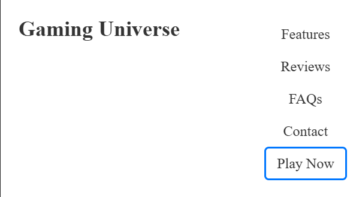

`Hero Section`

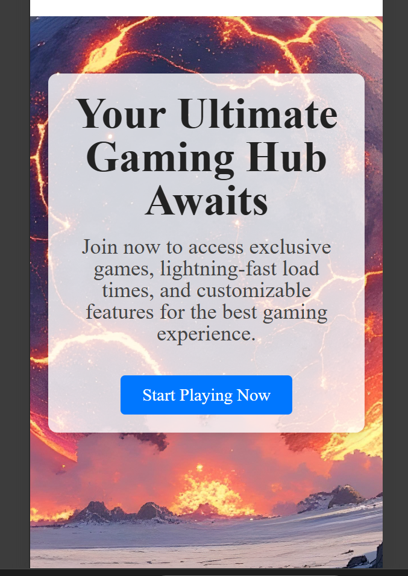

`Value Proposition`

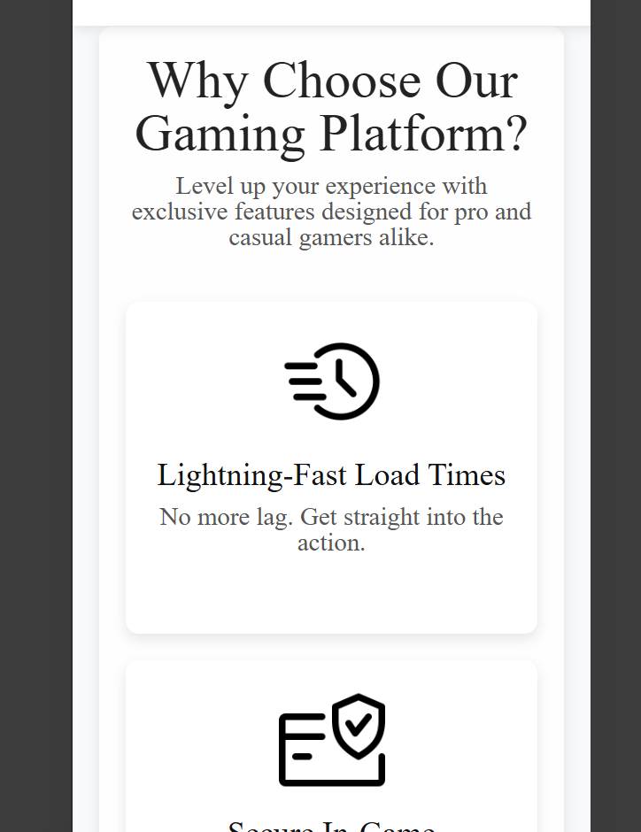

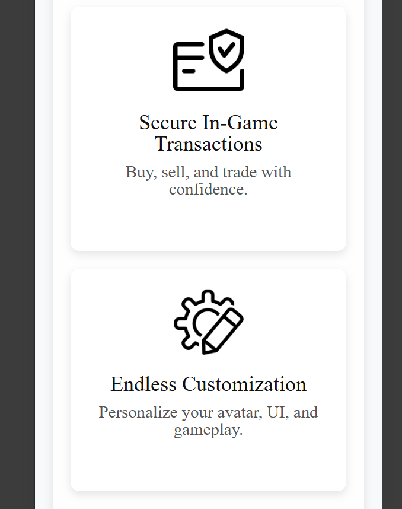

`Call to Action`

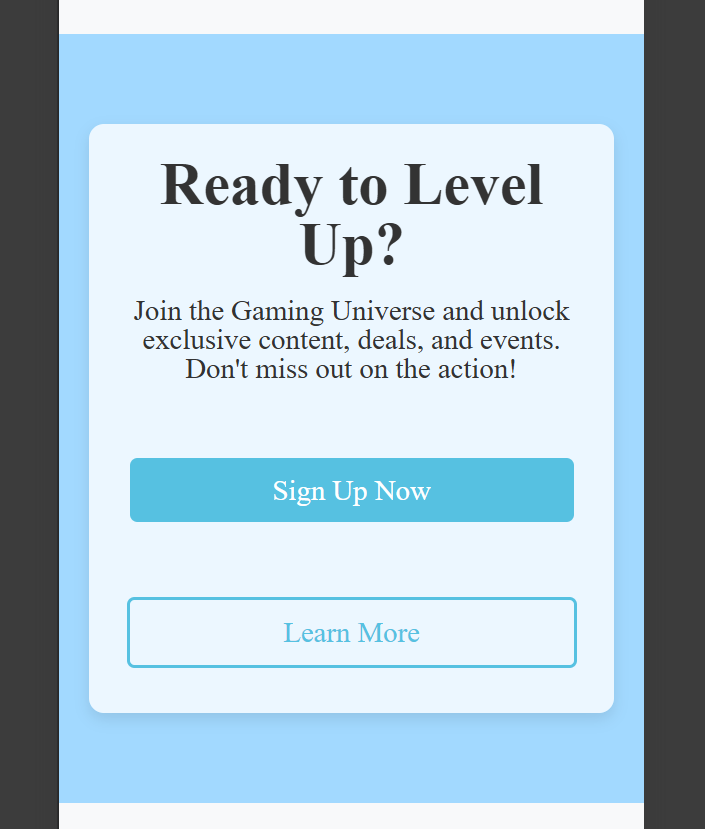

`Social Proof`

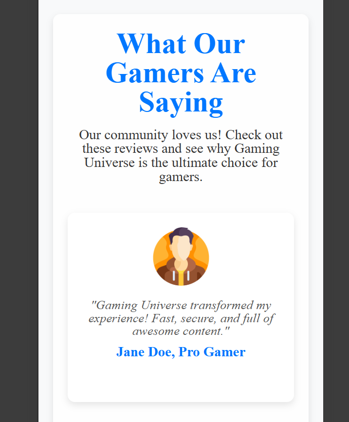

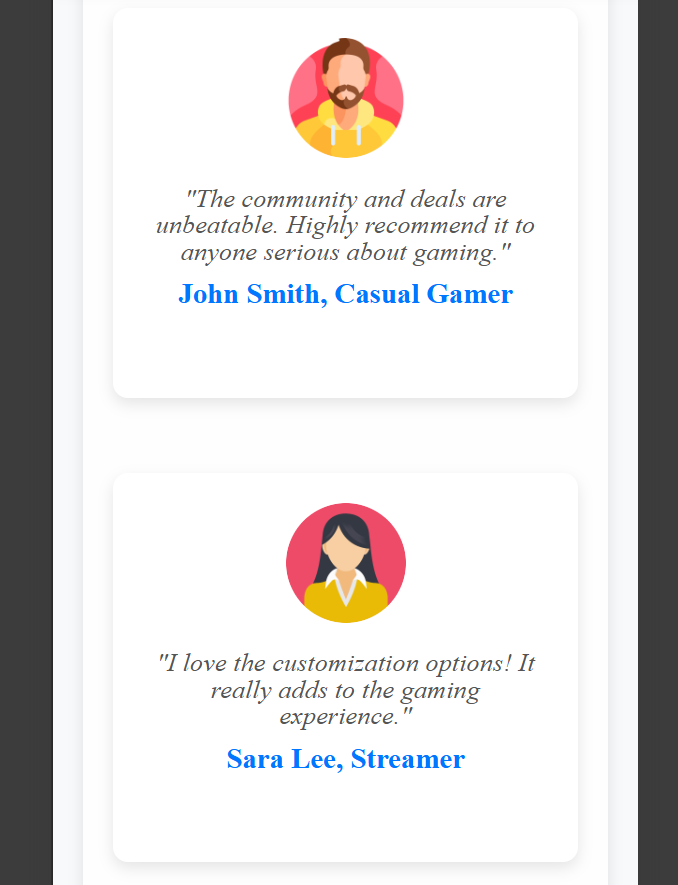

`FAQs`

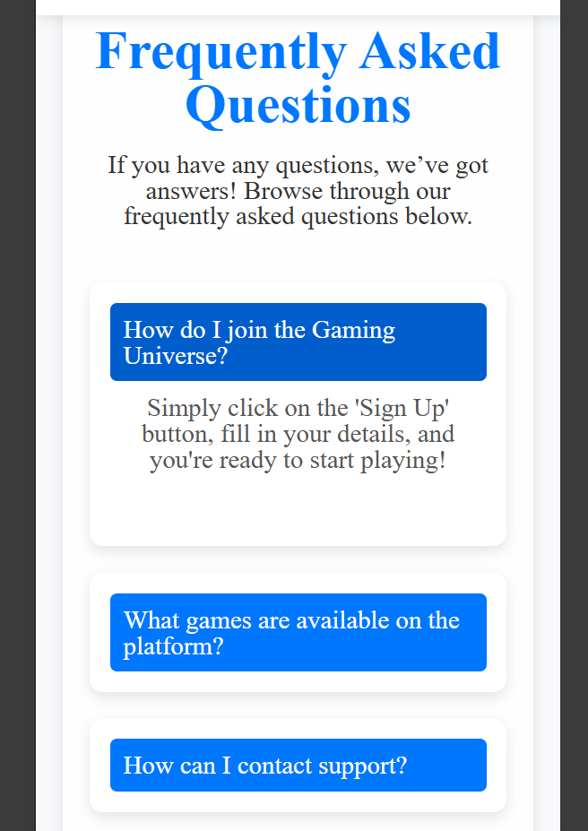

`Contact Section`

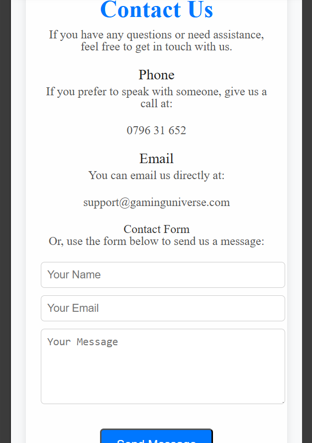

And here is the mobile-only `Download App` section:

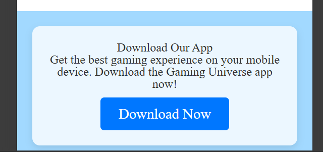

### Mascot

For the second part of the requirements, I added a mascot to the website—a gaming controller that aligns with the gaming theme. The mascot appears in the bottom-right corner after a 5-second delay, animated with a tilting motion to make it visually appealing. When hovered, it displays a welcome message ('Ready to level up? Let’s play!'), encouraging users to interact with the site.

`Mascot on Desktop`

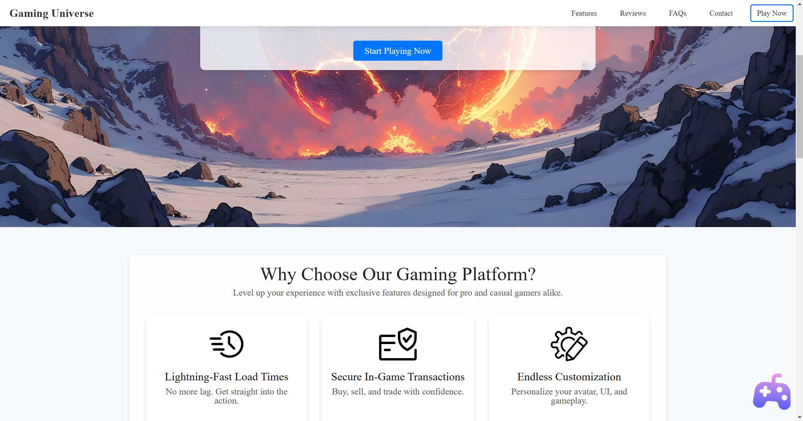

`Mascot on Mobile`

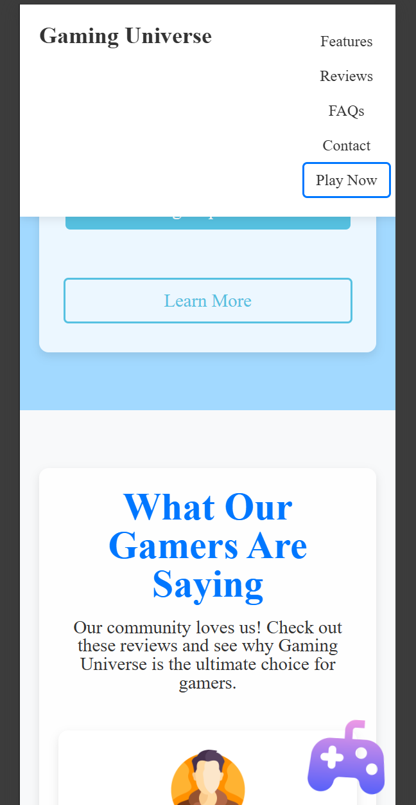

`Mascot Hover Effect`

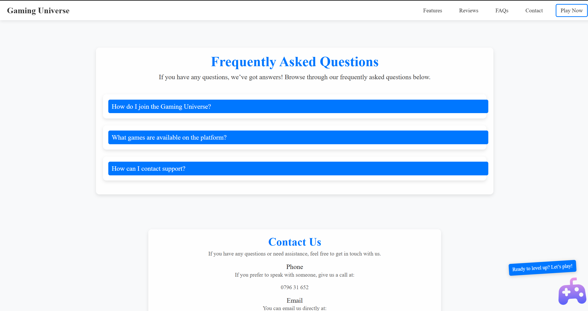

### Conclusion

Through this lab, I learned how to implement responsive design using media queries and create interactive elements like a mascot with CSS animations.

### Live Demo

**Github Pages Link:** https://bostan-victor.github.io/tum-web-lab2/